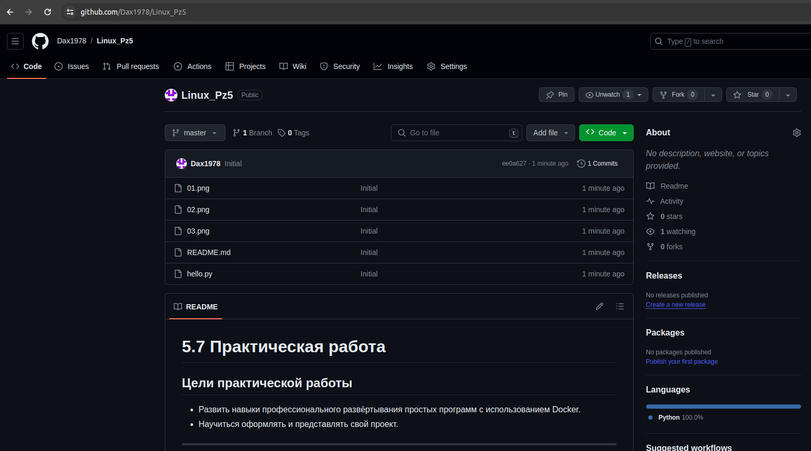
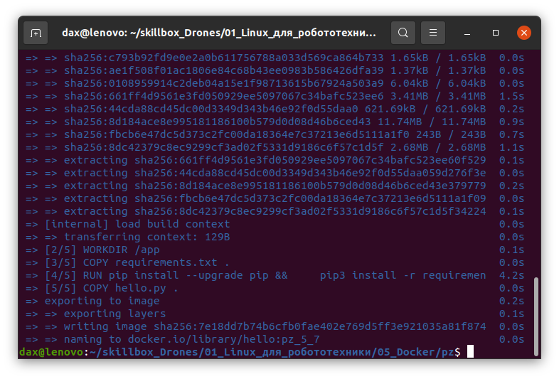
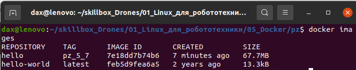
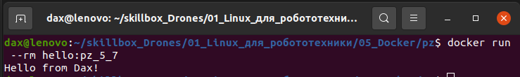
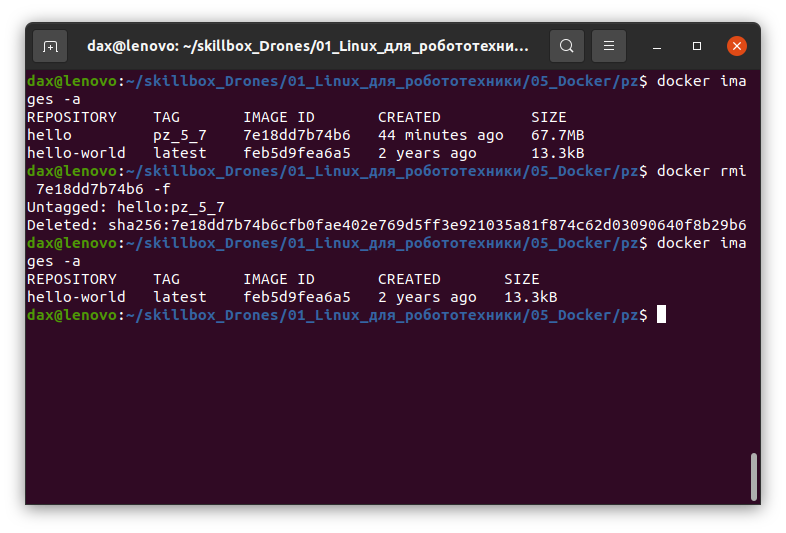
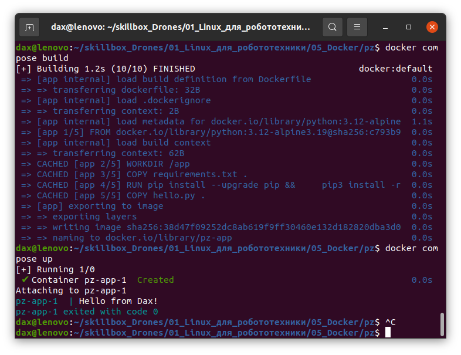

# 5.7 Практическая работа

## Цели практической работы

* Развить навыки профессионального развёртывания простых программ с использованием Docker. 
* Научиться оформлять и представлять свой проект.

---

## Мои шаги выполнения практического задания

1. Установка Docker и Docker Compose
    1. Установил (правда много ранее) Docker и Docker Compose<br>
        Уже было установлено ранее и там крутятся контейнеры<br>
        <br>
        
    2. Добавляю своего пользователя в группу<br>
        `sudo usermod -aG docker ${USER}`<br>
        <br>
        ___Стоит помнить, что на продакшене, такое делать НИ В КОЕМ СЛУЧАЕ НЕЛЬЗЯ! Это практически выдача рутовых прав пользователю___

2. Разработка простой программы:
    1. Пишу простую программу-приветствие на _python_<br>
        ```python
        def hello():
            return "Hello from Dax!"

        print(hello())
        ```
    2. Создал репозиторий на GitHub для моего проекта<br>
        <br>

3. Создаю Docker-образ для программы:
    1. Создаю Dockerfile для сборки образа, включающего мою программу и зависимости<br>
        ```Dockerfile
        FROM python:3.12-alpine3.19

        # This flag is important to output python logs correctly in docker!
        ENV PYTHONUNBUFFERED 1
        # Flag to optimize container size a bit by removing runtime python cache
        ENV PYTHONDONTWRITEBYTECODE 1

        # Устанавливаю рабочую директорию
        WORKDIR /app

        # Копирую файл зависимостей (в данном случае их нет, но знать нужно...) 
        COPY requirements.txt .

        # Запускаю команду, выполняющуюся ВО ВРЕМЯ СБОРКИ контейнера
        RUN pip install --upgrade pip && \
            pip3 install -r requirements.txt

        # Копирую файл hello.py в рабочую директорию в контейнере
        COPY hello.py .

        # Запускаю команду, выполняющуюся ПОСЛЕ СБОРКИ контейнера
        CMD ["python", "hello.py"]
        ```
    2. Собираю Docker-образ из Dockerfile<br>
        `docker build -t hello:pz_5_7 .`<br>
        <br>

        `docker images -a`<br>
        <br>

4. Запуск и тестирование Python-приложения в Docker-контейнере<br>
    1. Запускаю Docker-контейнер из созданного образа<br>
        `docker run --rm hello:pz_5_7`<br>
        <br>
        _Запуск был проведен с ключем_ ***--rm*** _для удаления контейнера по окончании его работы_<br>

5. Работа с Docker Compose<br>
    1. Ранее выводил список образов. До начала работы с _docker compose_ удалю ранее созданные образы<br>
        `docker rmi 7e18dd7b74b6 -f`<br>
        <br>

    2. Создаю docker-compose.yml, который запускает ваш Docker-контейнер с программой<br>
        ```yaml
        # Версия схемы
        version: "3"

        # Определяем список сервисов — services (в ДЗ только 1 сервис - программа hello)
        # Эти сервисы будут частью нашего приложения
        services:
        app: # Имя сервиса
            build:
            # Контекст для сборки образа,
            # в данном случае, текущая директория
            context: .
            # Имя Docker-файла из которого будет собран образ
            dockerfile: Dockerfile
        ```
    3. Создаю образ с Docker Compose<br>
        `docker compose build`<br>

    4. Запускаю созданный образ<br>
        `docker compose up`<br>
        <br>
    ---
    _Все работает!_ 