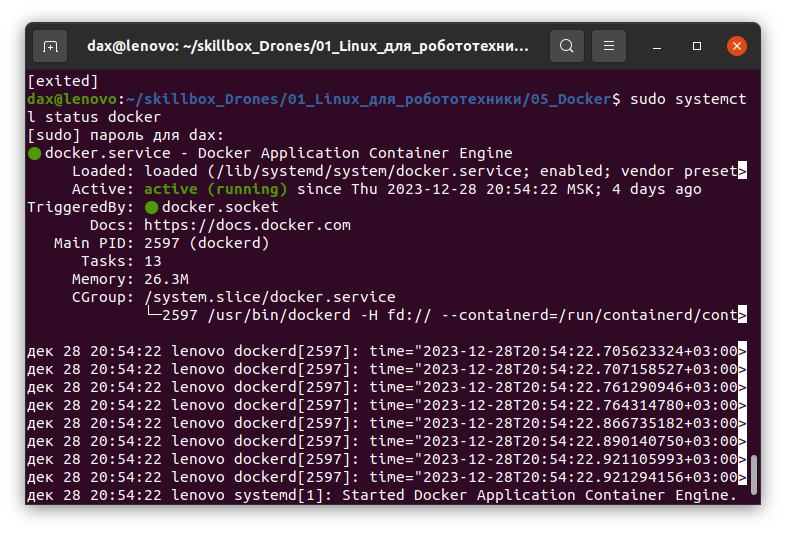
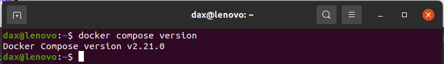
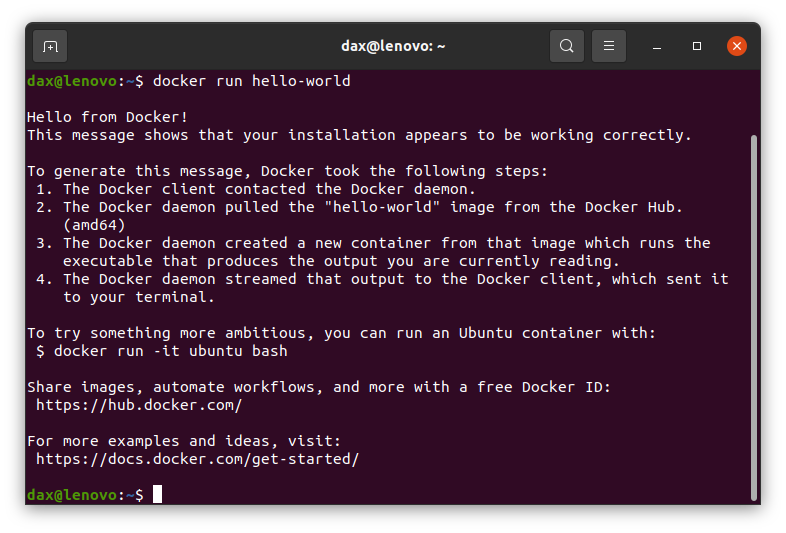

# 5.7 Практическая работа

## Цели практической работы

* Развить навыки профессионального развёртывания простых программ с использованием Docker. 
* Научиться оформлять и представлять свой проект.

---

## Мои шаги выполнения практического задания

1. Установка Docker и Docker Compose
    1. Установил (правда много ранее) Docker и Docker Compose<br>
        Уже было установлено ранее и там крутятся контейнеры<br>
        <br>
        
    2. Добавляю своего пользователя в группу<br>
        `sudo usermod -aG docker ${USER}`<br>
        <br>
        ___Стоит помнить, что на продакшене, такое делать НИ В КОЕМ СЛУЧАЕ НЕЛЬЗЯ! Это практически выдача рутовых прав пользователю___


2. Разработка простой программы:
    1. Пишу простую программу-приветствие на _python_<br>
        ```python
        def hello():
            return "Hello from Dax!"

        print(hello())
        ```
    2. Создайте репозиторий на GitHub для вашего проекта.


3. Создание Docker-образа для программы:
    а. Создайте Dockerfile для сборки образа, включающего вашу программу и зависимости.
    б. Соберите Docker-образ из вашего Dockerfile.
4. Запуск и тестирование Python-приложения в Docker-контейнере:
    а. Запустите Docker-контейнер из созданного образа.
    б. Проверьте, что ваша программа работает корректно внутри контейнера.
5. Работа с Docker Compose:
    а. Создайте docker-compose.yml, который запускает ваш Docker-контейнер с программой.
    б. Добавьте комментарии в docker-compose.yml, объясняющие его структуру и команды.
    в. Убедитесь, что Docker Compose позволяет запустить ваш контейнер.
6. Оформление проекта на GitHub:
    а. Поместите ваш Dockerfile и docker-compose.yml в репозиторий на GitHub.
    б. Подготовьте README.md, описывающий ваш проект и процесс запуска программы с помощью Docker и Docker Compose.